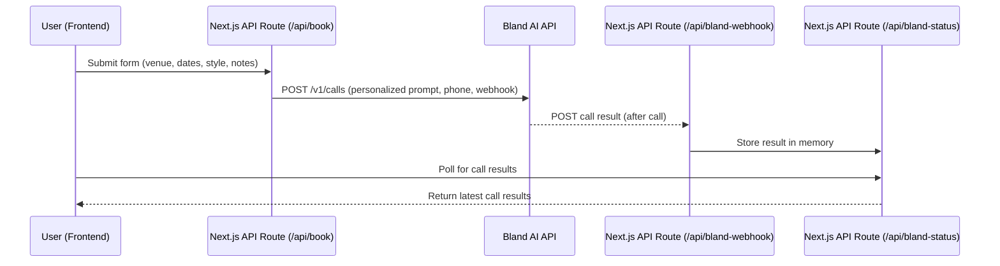

# AI DJ Booker

A full-stack Next.js app that uses Bland AI to act as a booking agent for DJs. The app calls venues on your behalf, pitches your DJ act, and collects contact info for follow-up.

## Features

- Modern Next.js frontend with a booking form
- Dynamic prompt generation for Bland AI calls
- Real-time call status updates via webhooks
- In-memory storage for call results (demo/dev)
- Easily customizable for your own DJ, script, or venues

## How It Works

1. Enter your DJ details, dates, style, notes, and the venue name in the form.
2. The backend sends a call request to Bland AI with a personalized script.
3. Bland AI calls the venue, delivers your pitch, and collects a contact if interested.
4. Webhook results are displayed live in the UI.

## Data Flow

1. **Frontend Form:** User enters venue, dates, style, and notes.
2. **Form Submission:** Data is sent to `/api/book` (backend API route).
3. **Backend:** Generates a personalized prompt and sends a POST to Bland AI's API.
4. **Bland AI:** Calls the venue and interacts using the prompt.
5. **Webhook:** Bland AI sends call results to `/api/bland-webhook`.
6. **In-Memory Store:** Webhook handler saves results in memory.
7. **Frontend Polling:** UI polls `/api/bland-status` for updates and displays them live.



## Setup & Development

### 1. Clone the Repo

```bash
git clone https://github.com/manivannansenthil/ai-dj-booker.git
cd ai-dj-booker/frontend
```

### 2. Install Dependencies

```bash
npm install
```

### 3. Environment Variables

Create a `.env.local` file in the `frontend` directory:

```
BLAND_API_KEY=your-bland-ai-api-key-here
```

### 4. Start the Dev Server

```bash
npm run dev
```

### 5. Expose Localhost for Webhooks (ngrok)

Bland AI requires an HTTPS webhook. Use [ngrok](https://ngrok.com/) or similar:

```bash
ngrok http 3000
```

Update the webhook URL in `frontend/src/app/api/book/route.ts` to match your ngrok HTTPS URL.

## Bland AI Integration

- Uses the `/v1/calls` endpoint with dynamic prompt, Estella voice, and custom first sentence.
- Webhook endpoint at `/api/bland-webhook` receives call results and updates the UI.
- See [Bland AI docs](https://docs.bland.ai/) for more info.

## Customization

- Change the prompt/script in `frontend/src/app/api/book/route.ts`.
- Update the static venues list or connect to a real venue database/API.
- Tweak the frontend UI in `frontend/src/app/page.tsx`.

## Roadmap

- [ ] Add persistent storage for call results
- [ ] Support multiple venues per submission
- [ ] Deploy to Vercel or similar
- [ ] Add authentication for DJs

## License

MIT
