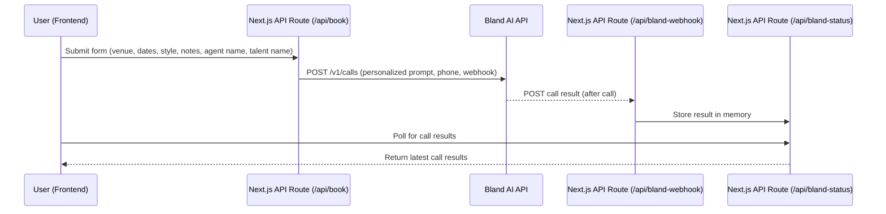

# AI DJ Booker

A full-stack Next.js app that uses Bland AI to act as a booking agent for DJs. The app calls venues on your behalf, pitches your DJ act, and collects contact info for follow-up.

## Tech Stack

- **Frontend:** Next.js 15, React 19, TypeScript, Tailwind CSS
- **Backend:** Next.js API routes
- **AI Voice:** Bland AI (Samantha voice)
- **UI/UX:** Custom dark theme, animated gradients, tactile button effects, modern form design

## Features

- Modern Next.js frontend with a booking form
- **Test Call Flow:** Try your pitch on your own phone before sending to venues
- **Dynamic Prompt:** Customizable, persuasive, and warm AI script with agent and talent names
- **Contact Info Extraction:** Collects and displays email/phone from venue during call
- **Real-time call status updates** via webhooks
- **Animated UI:** Toast notifications, animated scroll arrow, button shine, and more
- **Beautiful dark UI:** Apple-inspired, premium look with custom-styled date pickers
- In-memory storage for call results (demo/dev)
- Easily customizable for your own DJ, script, or venues

## How It Works

1. Enter your DJ details, dates, style, notes, agent name, and talent name in the form.
2. Optionally, send a test call to your own phone to preview the pitch.
3. Once happy, send the booking request to the venue(s).
4. The backend sends a call request to Bland AI with a personalized script.
5. Bland AI calls the venue, delivers your pitch, and collects a contact if interested.
6. Webhook results are displayed live in the UI, including any collected email/phone.

## Data Flow

1. **Frontend Form:** User enters venue, dates, style, notes, agent name, and talent name.
2. **Form Submission:** Data is sent to `/api/book` (backend API route).
3. **Backend:** Generates a personalized prompt and sends a POST to Bland AI's API.
4. **Bland AI:** Calls the venue and interacts using the prompt.
5. **Webhook:** Bland AI sends call results to `/api/bland-webhook`.
6. **In-Memory Store:** Webhook handler saves results in memory.
7. **Frontend Polling:** UI polls `/api/bland-status` for updates and displays them live.



## Local Development

1. **Clone the Repo**
   ```bash
   git clone https://github.com/manivannansenthil/ai-dj-booker.git
   cd ai-dj-booker/frontend
   ```
2. **Install Dependencies**
   ```bash
   npm install
   ```
3. **Set Environment Variables**
   Create a `.env.local` file in the `frontend` directory:
   ```
   BLAND_API_KEY=your-bland-ai-api-key-here
   ```
4. **Start the Dev Server**
   ```bash
   npm run dev
   ```
5. **Expose Localhost for Webhooks (Optional for Bland AI)**
   If testing webhooks locally, use [ngrok](https://ngrok.com/):
   ```bash
   ngrok http 3000
   ```
   Update the webhook URL in `frontend/src/app/api/book/route.ts` to match your ngrok HTTPS URL.

## Deployment

- **Vercel (Recommended):**

  1. Push your code to GitHub.
  2. Go to [vercel.com](https://vercel.com/) and import your repo.
  3. Set the `BLAND_API_KEY` environment variable in the Vercel dashboard.
  4. Deploy!

- **Other Hosts:**
  - Any Node.js host that supports Next.js 15+ and environment variables will work.
  - Make sure to set up HTTPS for webhooks if using Bland AI in production.

## Bland AI Integration

- Uses the `/v1/calls` endpoint with dynamic prompt, Estella voice, and custom first sentence.
- Webhook endpoint at `/api/bland-webhook` receives call results and updates the UI.
- See [Bland AI docs](https://docs.bland.ai/) for more info.

## Customization

- Change the prompt/script in `frontend/src/app/api/book/route.ts`.
- Update the static venues list or connect to a real venue database/API.
- Tweak the frontend UI in `frontend/src/app/page.tsx`.

## Roadmap

- [ ] Add persistent storage for call results
- [ ] Support multiple venues per submission
- [ ] Deploy to Vercel or similar
- [ ] Add authentication for DJs

## License

MIT
